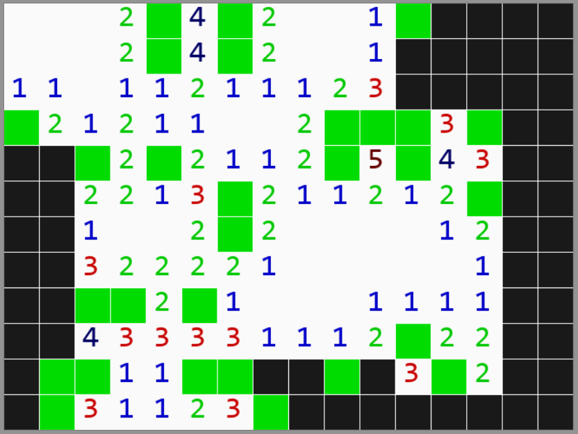

# Minesweeper Game
Classic minesweeper game made with Python and Pygame.

* Left click to open cells, right click to put flags
* You can configure "variables.py" file to change basic settings. 
## How to run the game
You need  to run the "game.py" file after installing Python and Pygame.
## Screenshot

